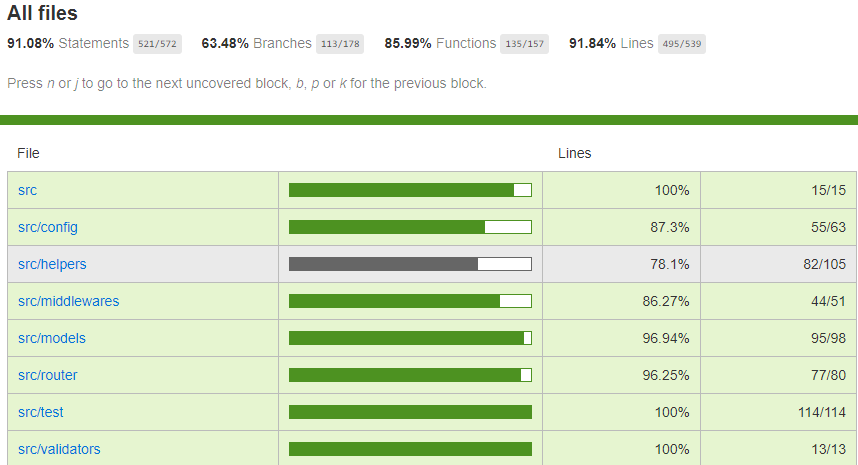

# movie-store

## Description

Basic REST service for storing movies descriptions (fetched from omdbapi) and comments in mongoDB.

## Requirements

-   npm (^v6) with node (^v9) installed
-   Running locally - needs running mongoDB
-   Running in docker - docker and docker-compose needs to be installed

## Routes

### /movies

### post

adds or updates existing movie in db

#### request body:

```
title: String
```

or

```
id: String
```

#### responses:

200 with response body:

```
id: String
```

or  
404 when a movie has not been found on omdbapi

### get

returns a movie or movies from db

#### request query:

```
title: String
```

or

```
id: String
```

or  
empty for all movies

#### responses:

200 with response body:

```
id: String,
Title: String
Year: Number,
Rated: String,
Released: Date,
Runtime: String,
Genre: [String],
Director: [String],
Writer: [String],
Actors: [String],
Plot: String,
Language: String,
Country: String,
Awards: String,
Poster: Url,
Ratings: [{
    Source: String,
    Value: String
}],
Metascore: String,
imdbRating: String,
imdbVotes: String,
Type: String,
DVD: Date,
BoxOffice: Number,
Production: String,
Website: Url
```

or  
200 with the same body but with array of movies insted  
or  
404 when a movie has not been found on db

### /comments

### post

adds a comment to movie in db

#### request body:

```
title: String,
comment: String
```

or

```
id: String,
comment: String
```

#### responses:

200 with response body:

```
movieId: String

```

or  
404 when a movie has not been found on db

### get

returns a comments to a movie from db

#### request query:

```
title: String
```

or

```
id: String
```

or  
empty for all movies

#### responses:

200 with response body:

```
movieId: String,
comments: [String]
```

or  
200 with the same body but with array of movies comments insted  
or  
404 when a movie has not been found on db

## Environment variables

Environment variables are stored in .env file for all environment types or taken directly from OS. They can be overridden by environment type specific variables from .env files (eg. .env_dev).

### Required

-   NODE_ENV - environment name
-   PORT - server local tcp port
-   MONGODB_URI - connection string to mongodb
-   API_KEY - api key for omdbapi

### Optional

-   LOG_LEVEL - no | info | debug | trace, default: trace
-   LOG_BODY - should log request body, default: true
-   LOG_FILE - file where logs are stored, default: ./logs
-   LOG_TEMPLATE - template view template for logs, default: ./src/assets/log-template.html
-   PRINT_CONFIG - should print environment variables before starting, default: true
-   MOVIES_DATABASE_NAME - name of movies collection, default: movies_collection
-   PEOPLE_DATABASE_NAME - name of people collection, default: people_collection
-   GENRES_DATABASE_NAME - name of genres collection, default: genres_collection
-   COMMENTS_DATABASE_NAME - name of comments collection, default: comments_collection

## How to start

### Locally

first download dependencies:

```
npm i
```

to start:

```
npm start
```

### Docker

no need to provide MONGODB_URI  
server PORT is set to 8080  
to build:

```
npm run build:docker
```

to start:

```
npm run compose
```

### Tests

Requires the same setup as running locally  
first download dependencies:

```
npm i
```

run tests:

```
npm test
```

check coverage:

```
npm run coverage
```

Current coverage:



### todo

adding routes for graphQL
better api response serialization
rewriting with typescript
