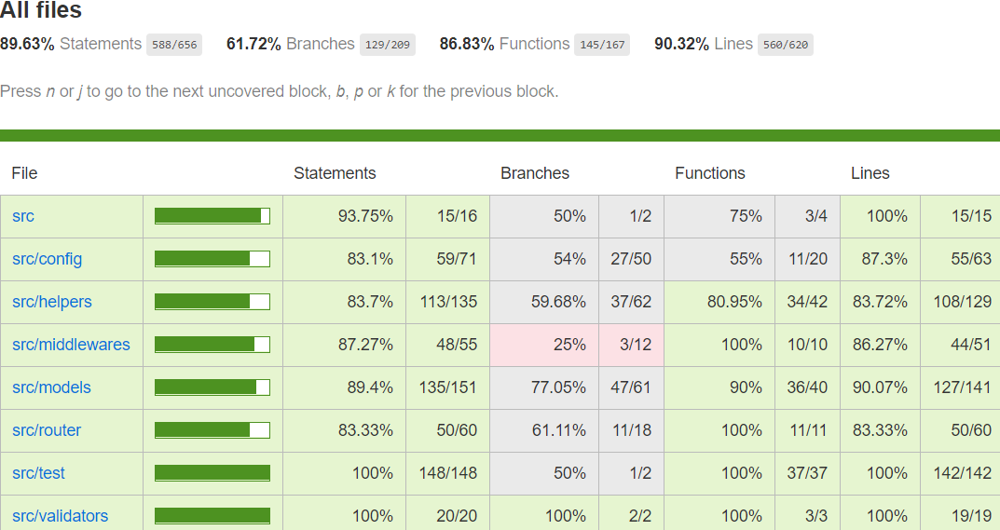

# Zombies

## Description
Basic REST service for storing zombies and their items.   
You can test the api at http://3.120.207.248:8000.  
E.g: [http://3.120.207.248:8000/items](http://3.120.207.248:8000/items)

## Requirements
- npm (^v6) with node (^v9) installed
- running mongoDB (^4.0) 

## Routes
### /items
#### methods
##### get
returns a currently available items for zombies
###### responses  
200 with response body:
```
[
    ...{
        id: Number,
        name: String,
        price: Number
    }
]
```

### /zombies
#### methods
##### get
returns all zombies, their items and items values
###### responses  
200 with response body:
```
[
    ...{
        name: String,
        items: {
            items: [
                ...{
                    id: String,
                    name: String,
                    price: Number
                }
            ]
            value: {
                USD: Number,
                EUR: Number,
                PLN: Number
            }
        }
        updatedAt: Date,
        createdAt: Date,
        id: String
    }
]
```

#### put 
adds a new zombie 
##### request body
```
name: String // name of a zombie
```
##### responses  
200 with response body:
```
id: String
```

### /zombies/:id
#### request params
```
id: String // an id of a zombie
```
#### responses  
404 when zombie is not found  
or  
400 when zombie id is invalid
#### methods
##### get
returns a zombie by id with its items and items values
###### responses  
200 with response body:
```
name: String,
items: {
    items: [
        id: String,
        name: String,
        price: Number
    ]
    value: {
        USD: Number,
        EUR: Number,
        PLN: Number
    }
}
updatedAt: Date,
createdAt: Date,
id: String
```

##### delete
deletes a zombie by id
###### responses  
200

### /zombies/:id/item
```
id: String // an id of a zombie
```
#### responses  
404 when zombie is not found  
or  
400 when zombie id is invalid
#### methods
##### put
adds an item to a zombie
###### request body
```
id: String // id of a currently available item for zombies
```
###### responses  
200  
or   
404 when an item is not found  
or  
400 when an item id is invalid

##### delete
deletes an item from a zombie
###### request body
```
id: String // id of a zombie's item
```
###### responses  
200  
or  
404 when a zombie does not hold an item  
or  
400 when an item id is invalid

## Environment variables
Environment variables are stored in .env file for all environment types or taken directly from OS. They can be overridden by environment type specific variables from .env files (eg. .env_dev).

### Required 
- NODE_ENV - environment name
- PORT - server local tcp port
- MONGO_CONNECTION_STRING - connection string to mongodb
- EXCHANGE_RATES_API - api to get current currencies rates
- ITEMS_API - api to get zombie items

### Optional
- LOG_LEVEL - no | info | debug | trace, default: trace
- LOG_BODY - should log request body, default: true
- LOG_FILE - file where logs are stored, default: ./logs
- LOG_TEMPLATE - template view template for logs, default: ./src/assets/log-template.html
- PRINT_CONFIG - should print environment variables before starting, default: true
- ZOMBIES_DATABASE_NAME - name of zombies collection, default: zombies
- ITEMS_DATABASE_NAME - name of items collection, default: items
- EXCHANGE_RATES_STORE_FILE - file to store current exchange rates
- MAX_TRANSACTION_CALLS - amount of maximum sequential call attempts after getting errors during a transaction (when resource is being used by other calls)

## How to start
first download dependencies:
```
npm i
```
to start:
```
npm start
```
### Tests
Requires working mongodb (^v.4.0).  
first download dependencies:
```
npm i
```
run tests:
```
npm test
```
check coverage:
```
npm run coverage
```
Current coverage:
    

